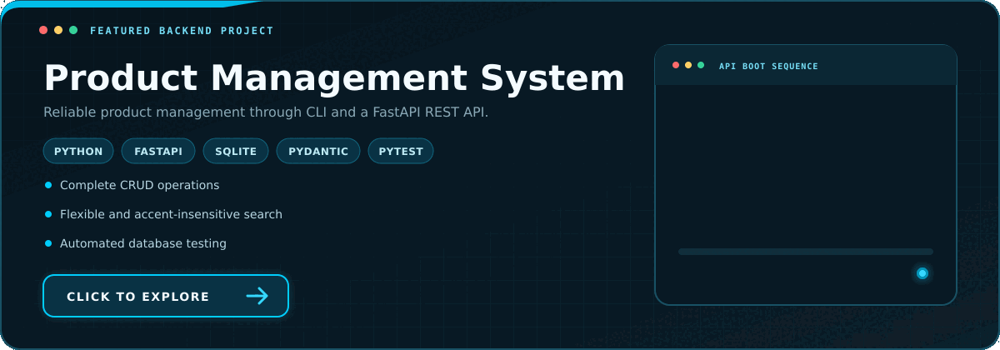

  

  

## 👨‍💻 About Me

I am a backend developer based in Cuiabá, Mato Grosso, Brazil, focused on building reliable applications with Python and FastAPI.
My current focus is REST API development, SQL, input validation, automated testing, and clean project organization.

## 🎓 Education

**Bachelor of Science in Computer Science** (in progress) 
Universidade de Cuiabá (UNIC) 
Expected graduation: December 2029

## 📌 Featured Project

  

A backend application for product management, combining a command-line interface with a FastAPI REST API, SQLite persistence, data validation, and automated testing.

## 🛠️ Core Stack

**Backend**

**Database**

**Testing & Tools**

## 📜 Courses & Certificates

- **[CS50's Introduction to Computer Science](LINK_DO_CURSO)** — Harvard University **(in progress)** 
  &nbsp;&nbsp;&#45; **Final project:** [Project Name](LINK_DO_PROJETO)

## 🌐 Languages

- **Portuguese:** Native
- **English:** Intermediate (B1) · Currently improving

<h2>🚧 Currently Building</h2>

 

### Multi-Tenant Project Management API

I am currently building a multi-tenant SaaS backend for managing companies, users, projects and tasks while keeping each company's data isolated.

**Planned stack:** Python · FastAPI · PostgreSQL · SQLAlchemy · Alembic · Pydantic · JWT · Pytest · Docker

**Current focus:**

- Company and user registration
- Authentication with password hashing and JWT
- Roles and permissions for owners, administrators and members
- Data isolation between companies
- Project and task management
- Automated testing

<h2>📊 GitHub Statistics</h2>

 

<h4>My GitHub activity, contribution rhythm and technology footprint.</h4>

  

 

 

<h2>📫 Contact</h2>

  
  
  

  

