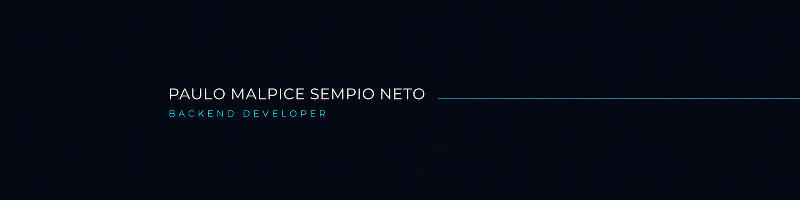

I build clean backend applications, REST APIs, and data-driven solutions with a focus on clarity, validation, and maintainable code.

---

## About Me

I am a backend developer based in Cuiabá, Mato Grosso, Brazil, focused on building reliable applications with Python. I enjoy turning business rules into structured APIs, validating data, working with relational databases, and protecting application behavior with automated tests.

My current work is centered on backend fundamentals, REST API development, SQL, and clean project organization.

## Featured Project

### [Product Management System](https://github.com/paulo-sempio-neto/Sistema_Produtos)

A product management application available through both an interactive command-line interface and a FastAPI REST API.

**Key features:**

- Complete product CRUD operations
- REST API built with FastAPI
- Persistent storage with SQLite
- Request validation with Pydantic
- Exact and partial product search
- Accent-insensitive name matching
- Product price filtering and average calculation
- Automated tests for the database layer
- Clear separation between API, database, menu, and validation responsibilities

**Built with:** Python · FastAPI · SQLite · SQL · Pydantic · Pytest · Uvicorn

[View source code →](https://github.com/paulo-sempio-neto/Sistema_Produtos)

## Core Stack

  
  
  
  
  
  

## Engineering Focus

- RESTful API design and HTTP fundamentals
- Relational data persistence and SQL
- Input validation and predictable error handling
- Automated testing and maintainable code organization
- Git-based workflows and clear technical documentation

## Let's Connect

I am open to connecting with developers, collaborators, and teams working on backend products.

