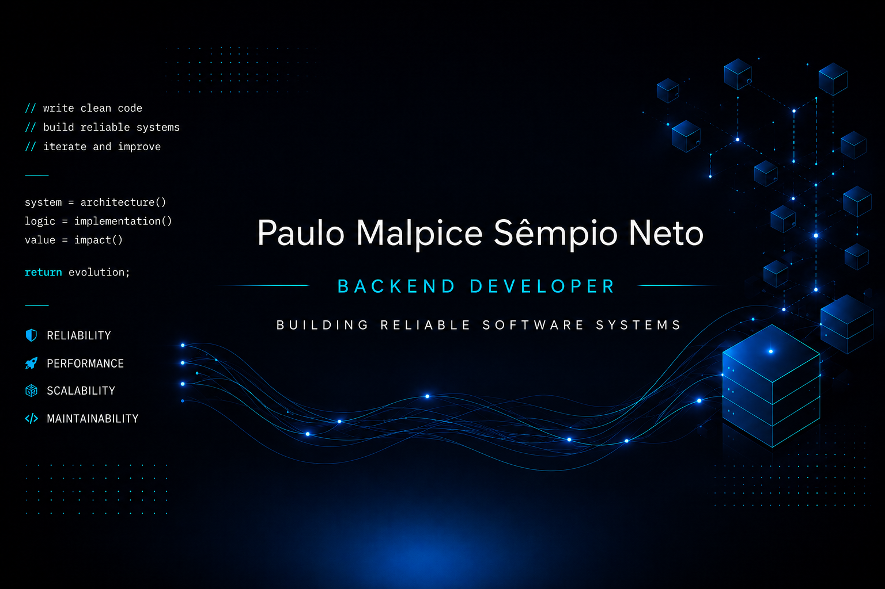

  

  I build clean backend applications and REST APIs with Python, focusing on validation, relational data, automated testing, and maintainable code.

---

## About Me

I am a backend developer based in Cuiabá, Mato Grosso, Brazil, focused on building reliable applications with Python and FastAPI.

My current focus is REST API development, SQL, input validation, automated testing, and clean project organization.

## Featured Project

### [Product Management System](https://github.com/paulo-sempio-neto/Sistema_Produtos)

A product management application with a command-line interface and a FastAPI REST API.

* Complete product CRUD operations
* SQLite persistence and Pydantic validation
* Exact, partial, and accent-insensitive product search
* Automated database tests with Pytest

**Built with:** Python · FastAPI · SQLite · SQL · Pydantic · Pytest · Uvicorn

[View source code →](https://github.com/paulo-sempio-neto/Sistema_Produtos)

## Core Stack

## Engineering Focus

* REST APIs and HTTP fundamentals
* Relational databases and SQL
* Input validation and predictable error handling
* Automated testing and maintainable code
* Git-based workflows and technical documentation

## Let's Connect

I am open to connecting with developers, collaborators, and teams working on backend products.

[LinkedIn →](https://www.linkedin.com/in/paulo-sempio-neto)
